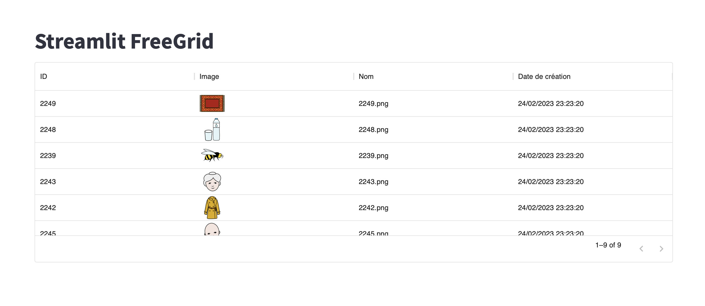

# Streamlit FreeGrid

## Installation

Install Freegrid component with the following command :
```
pip3 install streamlit-freegrid
```

## Parameters

| Name     | Type            | Desc                                                                                                                                                                                                                          |
|----------|-----------------|-------------------------------------------------------------------------------------------------------------------------------------------------------------------------------------------------------------------------------|
| df       | pd.DataFrame    | Data to display                                                                                                                                                                                                               |
| labels   | Dict[str, str]  | Header's labels dictionary key => column name value => desired output                                                                                                                                                         |
| types    | Dict[str, dict] | Desired format of column default => string custom => {"type": "image\|date",             "options"\|"lang": desired date format} See example to understand, options and lang are refering to Date.toLocaleString TSX function |
| hide     | List[str]       | List of columns' names not to display                                                                                                                                                                                         |
| height   | int             | Desired height of the component                                                                                                                                                                                               |
| pageSize | int             | Number of rows within a page                                                                                                                                                                                                  |
| key      | str             | Streamlit component's key                                                                                                                                                                                                     |

## Example



```python
import streamlit as st
from datetime import datetime
import streamlit_freegrid as sfg
import pandas as pd
import os

st.set_page_config(layout="wide")

st.markdown("# Streamlit FreeGrid")

images = [path for path in os.listdir("images")]
paths = ["images/" + name for name in images]
_ids = [path.replace(".png", "") for path in images]
dates = [datetime.now() for i in range(len(images))]

df = pd.DataFrame({"_id": _ids, "path": paths, "name": images, "creation": dates})

sfg.streamlit_freegrid(df=df,
                   labels={"_id": "ID",
                           "name": "Nom",
                           "path": "Image",
                           "creation": "Date de création"},
                   types={"path": {"type": "image"},
                          "creation": {"type": "date",
                                       "options": {
                                           "dateStyle": "short",
                                           "timeStyle": "medium",
                                           "timeZone": "UTC"
                                       },
                                       "lang": "fr-FR"}},
                   pageSize=15,
                   key="test")
```